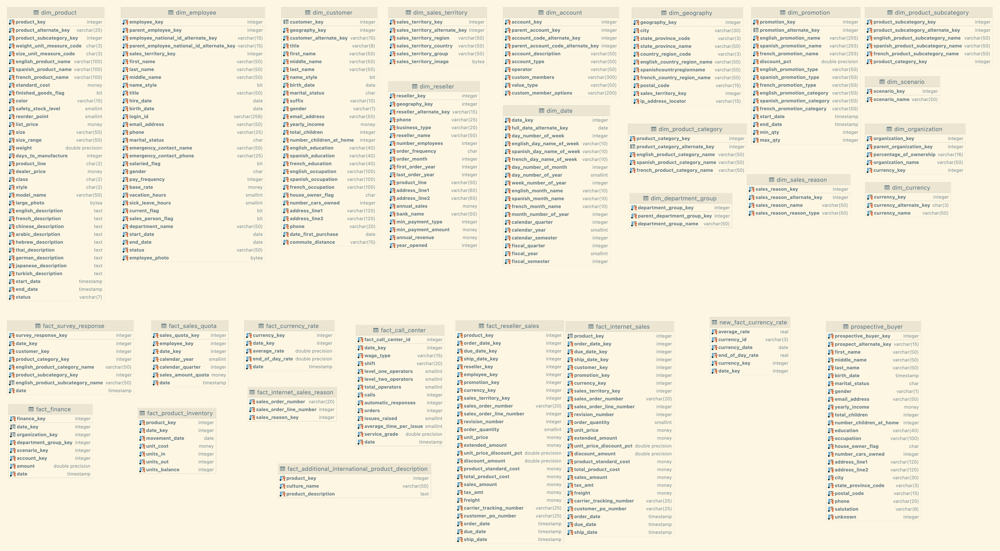

# SodaCL Workshop

SodaCL is new declarative language to started with data reliability engineering
with flexible and easy to understand syntax. This replaces soda-sql YAML syntax
with richer definitions of checks and with three different modes of check
results (pass, fail, warn).


# Setup and start

In a terminal window run :

`docker-compose up`

Open another terminal window and connect to the Soda Core container and run

`docker-compose exec soda-core /bin/bash`

This will open a shell with the
sodacl files, the prompt should look something like this:

```shell
➜ docker-compose exec soda-core /bin/bash
root@80e6a2167613:/sodacl#
```

You can run Soda core scan to test if everything is working as expected by
running

`soda scan -d adventureworks -c configuration.yml -ch checks.yml`

in the container. The command output should look like the following:


```shell
root@5d7f51f0ce0c:/sodacl# soda scan -d adventureworks -c configuration.yml  -ch checks.yml
Soda Core 0.0.1
Scan summary:
1/1 check PASSED:
    dim_account in adventureworks
      count between 20 and 100 [PASSED]
All is good. No failures. No warnings. No errors.
```

# Datawarehouse
We use adventureworks datawarehouse which contains a dimensional model schema with dimention tables and facts tables. You can connect and inspect the tables for details. Here's the schema diagram:


# Editing the checks
You can edit and create more checks in the folder `sodacl`, this file is mounted
in the sodacore container at `/sodacl`. You can run any SodaCL files as shown
above.
