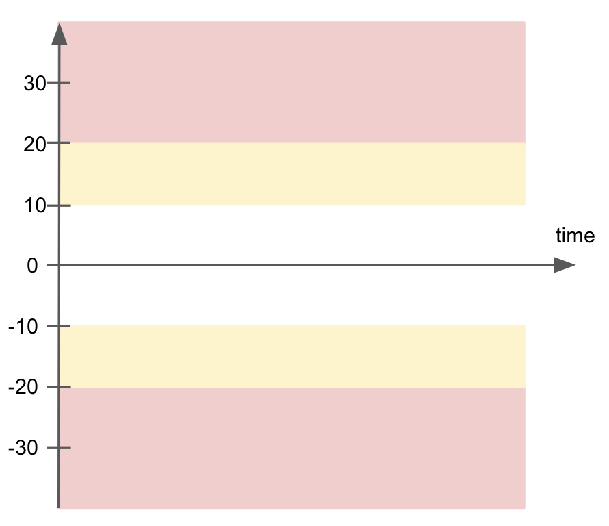
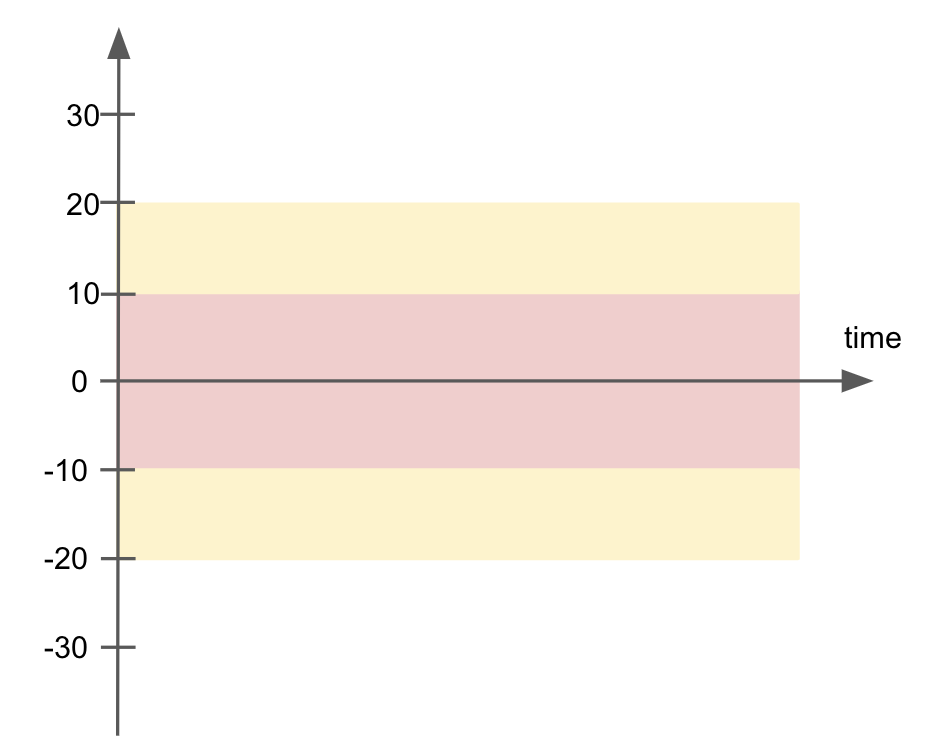

# Thresholds

## Fixed boundary thresholds

```yaml
checks for {table_name}:
  - count = 10.0
  - count < 11
  - count > 9
  - count <= 10
  - count >= 10
  - count != 0
  - count <> 0
  - count between 10 and 15
  - count between -5 and 10
  - count between (9 and 15]
  - count between [-5 and 11)
  - count not between 11 and 15
  - count not between -5 and 9
  - count not between (10 and 15
  - count not between -5 and 10)
```

`(` before the lower bound means it is not included.  So
* `count between (9 and 15` translates to `9 < count <= 15`
* `count not between ]10 and 15` translates to `count <= 10 or 15 < count`

`)` after the upper bound means it is not included.
* `count between -5 and 11)` translates to `-5 <= count < 11`
* `count not between -5 and 10)` translates to `count < -5 or 10 <= count`

Boundaries included are the default, but It is ok to explicitely specify.  These are all the equivalent:
* `count between 10 and 15`
* `count between [10 and 15`
* `count between 10 and 15]`
* `count between [10 and 15]`

## Change over time thresholds

## Anomaly detection thresholds

## Warning thresholds

In the above, checks only had pass/fail outcomes.  Here we show how to distinct between pass, warn and fail zones.

The next examples are shown for a count metric.  But a zone threshold can be used for all numeric metric checks.

The next example shows how to configure split warning and failure zones where inner is good and outer is bad:
```yaml
checks for CUSTOMERS:
  - count:
      warn: when not between -10 and 10
      fail: when not between -20 and 20
```
The above configuration gives a historic chart that looks like this:



The next example shows how to configure warning and failure zones where inner is bad and outer is good:
```yaml
checks for CUSTOMERS:
  - count:
      warn: when between -20 and 20
      fail: when between -10 and 10
```
The above configuration gives a historic chart that looks like this:



The next example shows how to configure a simple warning without a failure
```yaml
checks for CUSTOMERS:
  - count:
      warn: when < 20
```

The next example shows how to configure a warning zone band with a single failure value.
```yaml
checks for CUSTOMERS:
  - count:
      warn: when not between 1 and 20
      fail: when = 11
```
